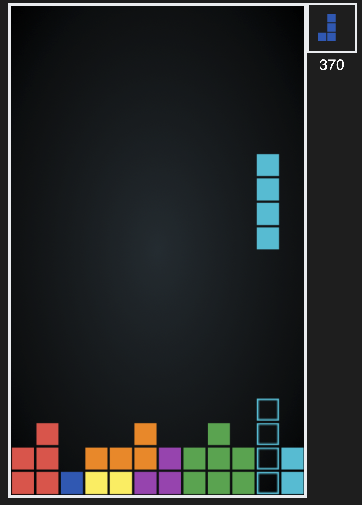

# Tetromino

[](https://app.netlify.com/sites/quirky-poitras-7ec457/deploys)


A tetromino-based puzzle game made in HTML5 and TypeScript.

[▶️ Play the game](https://blocks.verybadfrags.com/)



## Build

- Get [Node](https://nodejs.org/) and install dependencies

  ```sh
  npm i
  ```

- Build

  ```sh
  npm run build
  ```

## Links

- Colors by [Material UI](https://www.materialui.co/colors)
- Favicon by [UXWing](https://uxwing.com/)

## License

MIT
